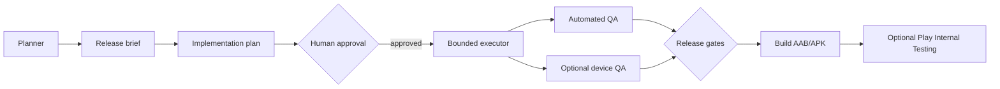

# Bounded Agent Release Kit

Provider-neutral release orchestration for Flutter and Android projects that use AI-assisted planning, bounded implementation, automated checks, physical-device QA, and optional Google Play Internal Testing uploads.

[](https://github.com/andika-vibe-code/bounded-agent-release-kit/actions/workflows/framework-check.yml)
[](LICENSE)

The kit keeps structural code knowledge, release state, and agent conversations separate. A model change or a long task should not silently change the approved scope.

## Why this exists

AI coding workflows are useful but can lose track of scope, acceptance evidence, or release safety. This framework adds explicit boundaries around the parts that matter most:

- The planner writes a brief and an implementation plan.
- A human approval removes the approval lock.
- The executor edits only the approved file allowlist.
- QA evidence is stored with the release state.
- Release scripts refuse to proceed when required evidence is missing.

## Architecture



## What it provides

- A read-first `codebase-memory-mcp` protocol for structural code knowledge.
- A compact planner/executor handoff contract with scope, non-goals, allowlists, and stop conditions.
- Deterministic release gates for approval, QA, and optional physical-device evidence.
- Bash scripts for release state, Android builds, device QA, and Play Internal Testing uploads.
- A GitHub Actions framework check that validates shell syntax and rejects common credential markers.

## Quick start

This repository is a framework template; it does not contain an application. Install it at the root of a Flutter application or copy its files into an application repository.

```bash
cp framework.env.example framework.env
# Edit framework.env and set ANDROID_PACKAGE_NAME.

scripts/orchestrate_release.sh init v0.1.0+1 "Describe the release objective"
```

Have the planner create `releases/v0.1.0+1/implementation_plan.md` from the brief. Review the plan, then approve and validate it:

```bash
scripts/approve.sh v0.1.0+1
scripts/orchestrate_release.sh validate v0.1.0+1
```

Run QA and release only after the required evidence exists:

```bash
scripts/orchestrate_release.sh device-qa v0.1.0+1
DEVICE_QA_REQUIRED=1 scripts/orchestrate_release.sh release v0.1.0+1
```

Read [the installation guide](docs/INSTALL.md) before enabling Play uploads. The scripts never create a Play service account, publish to production, or automate a graphical agent.

## Repository boundaries

This repository intentionally excludes application source code, Firebase configuration, keystores, service-account JSON, real release binaries, private codebase-memory artifacts, and copied model transcripts. See [SECURITY.md](SECURITY.md) before adding integrations.

## Project status

Early public template, currently focused on a small and auditable release core. See [the roadmap](ROADMAP.md) for planned improvements. Use a test application and the Internal Testing track before relying on it for production releases.

Feedback from real Flutter and Android projects is especially valuable. Please open an issue with your environment, the command you ran, and the smallest reproducible example.
